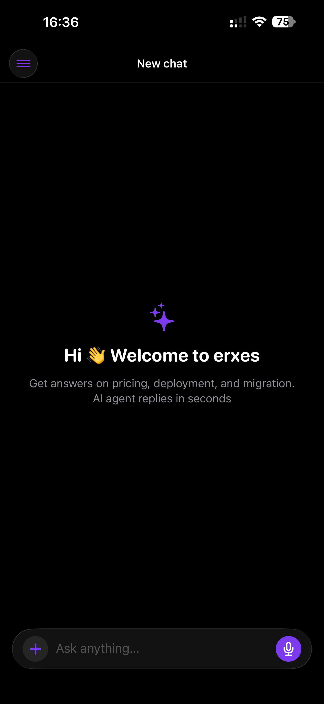
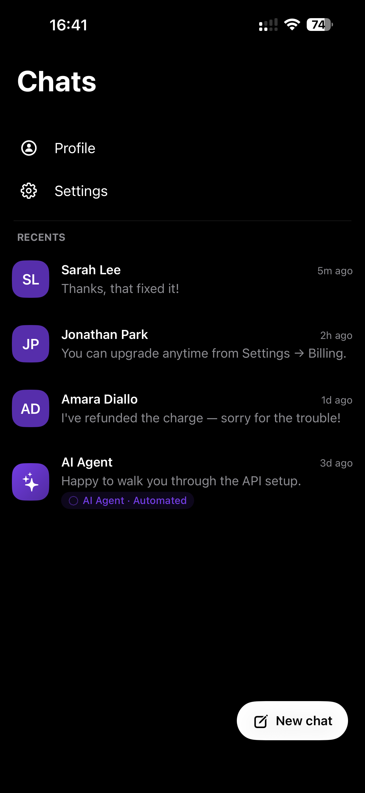

# erxes - IOS SDK

erxes iOS SDK is a secure, lightweight, and customizable iOS SDK that lets you embed a fully-featured customer messenger into your iOS application. Built on Swift and SwiftUI, it connects to the erxes platform and gives your users real-time chat, AI agent support, knowledge base access, and more — all inside your app.

<a href="https://docs.erxes.io/docs/intro">Documentation</a> <b>| </b> <a href="https://discord.com/invite/aaGzy3gQK5">Join our community</a>

## Status

<p align="center">
  <a href="./LICENSE">
    
  </a>
  <a href="#">
    
  </a>
  <a href="#">
    
  </a>
  <a href="#">
    
  </a>
  <a href="#">
    
  </a>
  <a href="https://discord.com/invite/aaGzy3gQK5">
    
  </a>
  <a href="https://twitter.com/erxeshq">
    
  </a>
</p>

**Classic mode** (`displayMode: .classic`)

<p align="center">
  
  
  
</p>

**Chat mode** (`displayMode: .chat`)

<p align="center">
  
  
</p>

## Features

- **Real-time Messenger** — Live chat powered by WebSocket with automatic reconnection and exponential backoff
- **AI Agent Support** — Integrated bot conversations with typing indicators and persistent menus
- **Floating Launcher Button** — Draggable `MessengerLaunchButton` that snaps to top-right or bottom-right corner
- **Attachment Uploads** — Photo picker with upload progress thumbnails shown inline before the message sends
- **Instagram-style Timestamps** — Swipe left to reveal per-message timestamps without leaving the conversation
- **Knowledge Base & FAQ** — Browse and search your erxes knowledge base articles in-app
- **Tickets** — Create and track support tickets directly from the messenger
- **Offline Caching** — `CachedAsyncImage` with NSCache + off-thread ImageIO downsampling; no UI-thread decode
- **Keyboard Native** — Zero-lag keyboard avoidance via `.safeAreaInset`; no custom `KeyboardObserver`

## Requirements

**Platform:**
- iOS 16.0+
- Xcode 15+

**Swift:**
- Swift 5.9+

**Dependency managers:**
- Swift Package Manager
- CocoaPods

**erxes backend:**
- A running erxes instance with a configured Messenger integration
- Your `integrationId` and server URL from the erxes admin panel

## Installation

This SDK supports both Swift Package Manager and CocoaPods.

For new Flutter projects using Flutter 3.44 or newer, Swift Package Manager is used automatically.

For existing Flutter projects that still use CocoaPods, no migration is required. The SDK also provides CocoaPods support.

You do not need to run `pod deintegrate` unless you intentionally want to migrate your whole iOS project to Swift Package Manager.

### Swift Package Manager

In Xcode: **File → Add Package Dependencies…** and enter:

```
https://github.com/erxes/erxes-ios-sdk
```

Or add it directly to your `Package.swift`:

```swift
dependencies: [
    .package(url: "https://github.com/erxes/erxes-ios-sdk", from: "0.30.0")
],
targets: [
    .target(
        name: "YourApp",
        dependencies: ["MessengerSDK"]
    )
]
```

### CocoaPods

Add the SDK to your app target in `ios/Podfile`:

```ruby
target 'Runner' do
  use_frameworks!

  pod 'ErxesMessengerSDK', '0.30.14'
end
```

Then install pods from the `ios` directory:

```sh
pod install
```

Import the SDK the same way for both dependency managers:

```swift
import MessengerSDK
```

### Publishing CocoaPods

CocoaPods publishing is automated with GitHub Actions. Add a repository secret named `COCOAPODS_TRUNK_TOKEN` using a CocoaPods trunk account that owns `ErxesMessengerSDK`.

To publish a version, update `ErxesMessengerSDK.podspec`, create a matching tag, and push it:

```sh
git tag 0.30.14
git push origin 0.30.14
```

The workflow also runs when a GitHub Release is published with the same tag name. The tag must match the podspec version exactly: `<version>`.

## Getting Started

### 1. Configure the SDK

Call this once at app launch (e.g. in your `App` initializer or `AppDelegate`):

```swift
import MessengerSDK

MessengerSDK.configure(
    MessengerConfig(
        endpoint: "https://your.erxes.instance",
        integrationId: "YOUR_INTEGRATION_ID"
    )
)
```

### Chat Mode

By default the SDK shows the **classic** 4-tab widget as a sheet. Set `displayMode: .chat` to switch to an AI-assistant-style full-screen shell instead — a new-chat home, a left drawer with the conversation list, and inline full-screen chats. In chat mode there is no floating launcher: the messenger presents itself full-screen automatically as soon as the connect handshake succeeds.

```swift
MessengerSDK.configure(
    MessengerConfig(
        endpoint: "https://your.erxes.instance",
        integrationId: "YOUR_INTEGRATION_ID",
        displayMode: .chat,
        homeActions: [
            ActionItem(id: "search", title: "Search", systemIcon: "magnifyingglass")
        ],
        drawerActions: [
            ActionItem(id: "profile", title: "Profile", systemIcon: "person.circle"),
            ActionItem(id: "settings", title: "Settings", systemIcon: "gearshape")
        ]
    )
)

// Fired when a homeActions/drawerActions item is tapped, with the action's id.
MessengerSDK.shared.onAction = { id in
    print("chat-mode action tapped:", id)
}
```

- `homeActions` — icon buttons rendered in the chat-mode header. Ignored in `.classic`.
- `drawerActions` — action rows rendered at the top of the conversation drawer. Ignored in `.classic`.
- `showLauncher()` / `hideLauncher()` are no-ops in `.chat` mode, since there's no floating launcher to show.

### 2. Identify the user (optional)

```swift
MessengerSDK.setUser(MessengerUser(
    email: "user@example.com",
    name: "Jane Doe"
))
```

### 3. Add the floating launcher button

The easiest way to expose the messenger is the draggable `MessengerLaunchButton`. Drop it as an overlay on your root view:

```swift
import MessengerSDK

struct ContentView: View {
    @ObservedObject private var sdk = MessengerSDK.shared

    var body: some View {
        YourRootView()
            .overlay {
                if sdk.isReady {
                    MessengerLaunchButton()
                        .transition(.scale(scale: 0.5).combined(with: .opacity))
                }
            }
            .animation(.spring(response: 0.4, dampingFraction: 0.7), value: sdk.isReady)
    }
}
```

The button snaps to the top-right or bottom-right corner — users can drag it between the two positions.

### 4. Or float the launcher from a UIKit / non-SwiftUI host

If your app isn't SwiftUI (UIKit, React Native, Flutter), call `showLauncher()` to float the same draggable button in a transparent overlay window above your content. Touches outside the button pass straight through, and it appears automatically once the connect handshake succeeds.

```swift
MessengerSDK.showLauncher()   // e.g. in AppDelegate / SceneDelegate after configure()
MessengerSDK.hideLauncher()   // remove it (e.g. on logout)
```

### 5. Or open the messenger programmatically

```swift
MessengerSDK.showMessenger(from: yourViewController)
```

## Contributing

Please read our [contributing guide](./CONTRIBUTING.md) and [code of conduct](./CODE_OF_CONDUCT.md) before submitting a Pull Request to the project. To report a security issue, see our [security policy](./SECURITY.md).

## Community Support

For general help using erxes, please refer to the [erxes documentation](https://docs.erxes.io). For additional help, you can use one of these channels:

- **[Discord](https://discord.com/invite/aaGzy3gQK5)** — Live discussion with the community
- **[GitHub](https://github.com/erxes/erxes-ios-sdk)** — Bug reports and contributions
- **[Feedback / Issues](https://github.com/erxes/erxes-ios-sdk/issues)** — Feature requests and bug reports
- **[Twitter](https://twitter.com/erxeshq)** — Get the news fast

## License

This project is licensed under the GNU Affero General Public License v3.0 (AGPLv3). See the [LICENSE](./LICENSE) file for licensing information.
